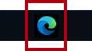

---
lab:
  title: Merancang Laporan di Power BI Desktop, Bagian 1
  module: Module 7 - Create Reports
ms.openlocfilehash: 426892501790aaecbe21ed2e7f9161c4490c9e3b
ms.sourcegitcommit: 9ea1e7e21b9b3c718030c94b1693d153a2010ec7
ms.translationtype: HT
ms.contentlocale: id-ID
ms.lasthandoff: 06/29/2022
ms.locfileid: "146650216"
---
# **Merancang Laporan di Power BI Desktop, Bagian 1**

**Perkiraan waktu untuk menyelesaikan lab adalah 45 menit**

Di lab ini Anda akan membuat laporan tiga halaman. Anda kemudian akan menerbitkannya ke Power BI, tempat Anda akan membuka dan berinteraksi dengan laporan tersebut.

Di lab ini Anda mempelajari cara:

- Merancang laporan

- Mengonfigurasi bidang visual dan properti format

### **Cerita lab**

Lab ini adalah salah satu dari sekian banyak lab yang dirancang sebagai cerita lengkap, mulai dari persiapan data hingga publikasi sebagai laporan dan dasbor. Anda dapat menyelesaikan lab dalam urutan apa pun. Namun, jika Anda ingin mengerjakan beberapa lab sekaligus, sebaiknya Anda mengerjakannya dengan urutan berikut:

1. Mempersiapkan Data di Power BI Desktop

2. Muat Data di Power BI Desktop

3. Data Model di Power BI Desktop

5. Membuat Perhitungan DAX di Power BI Desktop, Bagian 1

6. Membuat Perhitungan DAX di Power BI Desktop, Bagian 2

7. **Merancang Laporan di Power BI Desktop, Bagian 1**

8. Merancang Laporan di Power BI Desktop, Bagian 2

9. Buat Dasbor Power BI

10. Menganalisis Data di Power BI Desktop

11. Terapkan Keamanan Tingkat Baris

## **Latihan 1: Membuat Laporan**

Dalam latihan ini Anda akan membuat laporan tiga halaman bernama **Laporan Penjualan**.

### **Tugas 1: Memulai – Masuk**

Dalam tugas ini, Anda akan menyiapkan lingkungan untuk lab dengan masuk ke Power BI.

*Penting: Jika Anda sudah masuk ke Power BI, lanjutkan dari tugas berikutnya.*

1. Untuk membuka Microsoft Edge, pada bilah tugas, klik pintasan program Microsoft Edge.

    

1. Di jendela browser Microsoft Edge, navigasikan ke **https://powerbi.microsoft.com** .

    *Tips: Anda juga dapat menggunakan favorit Layanan Power BI di bilah favorit Microsoft Edge.*

1. Klik **Masuk** (terletak di sudut kanan atas).

    

1. Masukkan detail akun yang diberikan kepada Anda (lihat **Sumber Daya**).

1. Jika diminta untuk memperbarui kata sandi, masukkan kembali kata sandi yang diberikan, lalu masukkan dan konfirmasikan kata sandi baru.

    *Penting: Pastikan untuk mencatat kata sandi baru Anda.*

1. Selesaikan proses masuk.

1. Jika diminta oleh Microsoft Edge untuk tetap masuk, klik **Ya**.

1. Biarkan jendela browser Microsoft Edge terbuka.

### **Tugas 2: Memulai – Mengaktifkan Peta dan mengisi visual peta**

Dalam tugas ini, Anda akan mengaktifkan peta dan visual peta yang diisi di lingkungan lab dengan memperbarui pengaturan Integrasi di portal Admin Power BI. 

1. Untuk membuka portal Admin Power BI, di kanan atas browser, klik ikon **Pengaturan**.

    

1. Pilih **Portal Admin**.

    

1. Gulir ke bawah halaman ke pengaturan Integrasi. Klik panah untuk memperluas opsi Peta dan visual peta yang terisi.

    

1. Atur opsi Peta dan visual peta terisi ke **Diaktifkan**.

1. Klik **Terapkan**, untuk menerapkan perubahan. 

    

1. Pesan akan muncul di kanan atas browser yang menyatakan bahwa perubahan pengaturan Penyewa akan diterapkan dalam 15 menit ke depan. 

    

1. Biarkan jendela browser Microsoft Edge terbuka.

### **Tugas 3: Memulai – Membuka laporan**

Dalam tugas ini, Anda akan menyiapkan lingkungan untuk lab dengan membuka laporan awal.

*Penting: Jika Anda melanjutkan dari lab sebelumnya (dan Anda berhasil menyelesaikan lab tersebut), jangan selesaikan tugas ini; sebagai gantinya, lanjutkan dari tugas berikutnya.*

1. Untuk membuka Power BI Desktop, pada taskbar, klik pintasan Microsoft Power BI Desktop.

    

2. Untuk menutup jendela memulai, di kiri atas jendela, klik **X**.

    

3. Untuk masuk ke layanan Power BI, di kanan atas, klik **Masuk**.

    

4. Selesaikan proses masuk menggunakan akun yang sama yang digunakan untuk masuk ke layanan Power BI.

5. Untuk membuka file Power BI Desktop pertama, klik tab pita **File** untuk membuka tampilan backstage.

6. Pilih **Buka Laporan**.

    

7. Klik **Jelajahi Laporan**.

    

8. Di jendela **Buka**, navigasikan ke folder **D:\PL300\Labs\06-design-report-in-power-bi-desktop\Starter**.

9. Pilih file **Analisis Penjualan**.

10. Klik **Buka**.

    

11. Tutup semua jendela informasi yang mungkin terbuka.

12. Untuk membuat salinan file, klik tab pita **File** untuk membuka tampilan backstage.

13. Pilih **Simpan**.

    

14. Jika diminta untuk menerapkan perubahan, klik **Terapkan**.

    

15. Di jendela **Simpan Sebagai**, navigasikan ke folder **D:\PL300\MySolution**.

16. Klik **Simpan**.

    

### **Tugas 4: Merancang halaman 1**

Dalam tugas ini Anda akan merancang halaman laporan pertama. Setelah Anda menyelesaikan desain, halaman akan terlihat seperti berikut:

1. Di Power BI Desktop, untuk mengganti nama halaman, di kiri bawah, klik kanan **Halaman 1**, lalu pilih **Ganti nama**.

    

    *Tips: Anda juga dapat mengeklik dua kali nama halaman untuk mengganti namanya.*

2. Ganti nama halaman menjadi **Ringkasan**, lalu tekan **Enter**.

    

3. Untuk menambahkan gambar, pada tab pita **Sisipkan**, dari dalam grup **Elemen**, klik **Gambar**.

    

4. Di jendela **Buka**, navigasikan ke folder **D:\PL300\Resources**.

5. Pilih file **AdventureWorksLogo.jpg**, lalu klik **Buka**.

    

6. Seret gambar untuk memosisikannya di sudut kiri atas, dan juga seret penanda panduan untuk mengubah ukurannya.

    

7. Untuk menambahkan pemotong, pertama-tama batalkan pilihan gambar dengan mengeklik area kosong pada halaman laporan.
8. Di panel **Bidang**, pilih bidang **Tanggal \| Tahun** (bukan tingkat hierarki **Tahun**).
    
    *Lab menggunakan notasi steno untuk mereferensikan bidang. Ini akan terlihat seperti ini: **Tanggal \| Tahun**. Dalam contoh ini, **Tanggal** adalah nama tabel dan **Tahun** adalah nama bidang.*

9. Perhatikan bahwa tabel nilai tahun telah ditambahkan ke halaman laporan.

10. Untuk mengonversi visual dari tabel menjadi pemotong, di panel **Visualisasi**, pilih **Pemotong**.

    

11. Untuk mengonversi pemotong dari daftar menjadi dropdown, di kanan atas pemotong, klik panah bawah, lalu pilih **Dropdown**.

    

12. Ubah ukuran dan posisikan pemotong sehingga berada di bawah gambar dan lebarnya sama dengan gambar.

    

13. Di pemotong **Tahun**, buka daftar dropdown, pilih **FY2020**, lalu ciutkan daftar dropdown.

    

    *Halaman laporan sekarang difilter berdasarkan tahun **FY2020**.*

14. Batalkan pilihan pemotong dengan mengeklik area kosong pada halaman laporan.

15. Buat pemotong kedua, berdasarkan bidang **Wilayah \|Wilayah** (bukan tingkat hierarki **Wilayah**).

16. Biarkan pemotong sebagai daftar, lalu ubah ukuran dan posisikan pemotong di bawah pemotong **Tahun**.

    

21. Batalkan pilihan pemotong dengan mengeklik area kosong pada halaman laporan.

22. Untuk menambahkan bagan ke halaman, di panel **Visualisasi**, klik jenis visual **Bagan Kolom dan Baris Bertumpuk**.

    

23. Ubah ukuran dan posisikan visual sehingga berada di sebelah kanan logo, dan memenuhi lebar halaman laporan.

    

24. Seret dan lepas bidang berikut ke dalam visual:

    - Tanggal \| Bulan

    - Penjualan \| Penjualan

25. Di panel bidang visual (bukan panel **Bidang**—panel bidang visual terletak di bawah panel **Visualisasi**), perhatikan bahwa bidang ditetapkan ke sumber/area **sumbu X** dan **Sumbu kolom y**.

    

    *Dengan menyeret bidang ke dalam visual, bidang tersebut akan ditambahkan ke sumber/area default. Untuk presisi, Anda dapat menyeret bidang langsung ke dalam sumber/area, seperti yang akan Anda lakukan selanjutnya.*

26. Dari panel **Bidang**, seret bidang **Penjualan \| Margin Keuntungan** ke dalam sumber/area **Garis sumbu y**.

    

27. Perhatikan bahwa visual hanya memiliki 11 bulan.

    *Bulan terakhir tahun ini, Juni 2020, tidak ada penjualan (belum). Secara default, visual telah menghilangkan bulan dengan penjualan KOSONG. Sekarang Anda akan mengonfigurasi visual untuk ditampilkan sepanjang bulan.*

28. Di panel bidang visual, di sumber/area **sumbu X**, untuk bidang **Bulan**, klik panah bawah, lalu pilih **Tampilkan Item Tanpa Data**.

    

29. Perhatikan bahwa bulan **Juni 2020** sekarang muncul.

30. Hapus pilihan bagan dengan mengeklik area kosong pada halaman laporan.

31. Untuk menambahkan bagan ke halaman, di panel **Visualisasi**, klik jenis visual **Peta**.

    

32. Ubah ukuran dan posisikan visual sehingga berada di bawah bagan kolom/garis, sehingga memenuhi setengah lebar bagan di atas.

    

33. Tambahkan bidang berikut ke sumber/area visual:

    - Lokasi: **Wilayah  Negara

    - Legenda: **Produk \| Kategori**

    - Ukuran: **Penjualan \| Penjualan**

34. Hapus pilihan bagan dengan mengeklik area kosong pada halaman laporan.

35. Untuk menambahkan bagan ke halaman, di panel **Visualisasi**, klik jenis visual **Bagan Batang Bertumpuk**.

    

36. Ubah ukuran dan posisikan visual sehingga mengisi ruang halaman laporan yang tersisa.

    

37. Tambahkan bidang berikut ke sumber/area visual:

    - Sumbu: **Produk \| Kategori**

    - Nilai: **Penjualan \| Kuantitas**

38. Untuk memformat visual, buka panel **Format**.

    

39. Luaskan **Bilah** lalu grup **Warna**, lalu atur properti **Warna Default** ke warna yang sesuai (untuk melengkapi bagan kolom/garis).

40. Atur properti **Label Data** ke **Aktif**.

    

41. Simpan file Power BI Desktop.

    *Desain halaman pertama sekarang sudah selesai.*

### **Tugas 5: Merancang halaman 2**

Dalam tugas ini Anda akan merancang halaman laporan kedua. Setelah Anda menyelesaikan desain, halaman akan terlihat seperti berikut:

*Penting: Ketika detail petunjuk telah diberikan di lab, langkah-langkah lab akan memberikan petunjuk yang lebih ringkas. Jika memerlukan detail petunjuk, Anda dapat mengacu kembali ke tugas lain di lab ini.*

1. Untuk membuat halaman baru, di kiri bawah, klik ikon plus.

    

2. Ganti nama halaman menjadi **Keuntungan**.

    

  

3. Tambahkan pemotong berdasarkan bidang **Wilayah \|Wilayah**.

4. Gunakan panel **Format** untuk mengaktifkan opsi “Pilih Semua” (di grup **Pilihan**).

5. Ubah ukuran dan posisikan pemotong sehingga berada di sisi kiri halaman laporan, dan tingginya sekitar setengah halaman.

    

6. Tambahkan visual matriks, dan ubah ukuran serta posisikan sehingga memenuhi ruang yang tersisa di halaman laporan

    

7. Tambahkan hierarki **Tanggal \| Fiskal** ke sumber/area **Baris** matriks.

    

8. Tambahkan lima bidang tabel **Penjualan** berikut ke sumber/area **Nilai**:

    - Pesanan (dari folder **Jumlah**)

    - Sales

    - Biaya

    - Keuntungan

    - Margin Keuntungan

    

9. Di panel **Filter** (terletak di sebelah kiri panel **Visualisasi**), perhatikan sumber/area **Filter Pada Halaman Ini** (Anda mungkin perlu menggulir ke bawah).

    

10. Dari panel **Bidang**, seret bidang **Produk \| Kategori** ke dalam sumber/area **Filter Pada Halaman Ini**.

11. Di dalam kartu filter, di kanan atas, klik panah untuk menciutkan kartu.

    

    *Bidang yang ditambahkan ke panel **Filter** dapat memperoleh hasil yang sama seperti pemotong. Satu perbedaannya adalah bidang tersebut tidak memakan tempat di halaman laporan. Perbedaan lainnya adalah bidang tersebut dapat dikonfigurasi untuk mencapai persyaratan pemfilteran yang lebih canggih.*

12. Tambahkan setiap bidang tabel **Produk** berikut ke sumber/area **Filter Pada Halaman Ini**, menciutkan masing-masing, tepat di bawah kartu **Kategori**:

    - Subkategori

    - Produk

    - Warna

    

13. Simpan file Power BI Desktop.

    *Desain halaman kedua sekarang sudah selesai.*

### **Tugas 6: Merancang halaman 3**

Dalam tugas ini Anda akan merancang halaman laporan ketiga—dan terakhir—. Setelah Anda menyelesaikan desain, halaman akan terlihat seperti berikut:

1. Buat halaman baru, lalu ganti namanya menjadi **Performa Saya**.

1. Untuk menyimulasikan performa filter keamanan tingkat baris, seret bidang **Penjual (Performa) \| Penjual** ke filter tingkat halaman di panel filter.
    
     

1. Pilih **Michael Blythe**. Data pada halaman laporan **Performa Saya** sekarang akan difilter untuk menampilkan data hanya untuk Michael Blythe.

1. Tambahkan pemotong dropdown berdasarkan bidang **Tanggal \| Tahun**, lalu ubah ukurannya dan posisikan sehingga berada di sudut kiri atas halaman.

    

1. Di pemotong, atur halaman untuk difilter berdasarkan **FY2019**.

    

1. Tambahkan visual **Kartu Multi-baris**, lalu ubah ukuran dan posisikan ulang sehingga berada di sebelah kanan pemotong dan memenuhi sisa lebar halaman.

    

    

1. Tambahkan empat bidang berikut ke visual:

    - Penjualan \| Penjualan

    - Target \| Target

    - Target \| Varians

    - Target \| Margin Varians

1. Format visualnya:

    - Di grup **Nilai panggilan**, tambah properti **Ukuran Teks** menjadi **28pt**

    - Di grup **Latar Belakang**, atur **Warna** ke warna abu-abu muda

    

1. Tambahkan visual **Bagan Batang Berkluster**, lalu ubah ukuran dan posisikan sehingga berada di bawah visual kartu multi-baris dan memenuhi sisa tinggi halaman, dan setengah lebar visual kartu multi-baris.

    

    

1. Tambahkan bidang berikut ke sumber/area visual:

    - Sumbu: **Tanggal \| Bulan**

    - Nilai: **Penjualan \| Penjualan** dan **Target \| Target**

    

1. Untuk membuat salinan visual, tekan **Ctrl+C**, lalu tekan **Ctrl+V**.

1. Posisikan visual baru di sebelah kanan visual asli.

    

1. Untuk mengubah jenis visualisasi, di panel **Visualisasi**, pilih **Bagan Kolom Berkluster**.

    

    *Sekarang Anda dapat melihat data yang sama yang diungkapkan oleh dua jenis visualisasi yang berbeda. Ini bukan penggunaan tata letak halaman yang baik, namun, Anda akan meningkatkannya di lab **Merancang Laporan di Power BI Desktop, Bagian 2** dengan menindih visual yang lama. Dengan menambahkan tombol ke halaman, Anda akan mengizinkan pengguna laporan untuk menentukan mana dari dua visual yang terlihat.*

    *Desain halaman ketiga—dan terakhir—sekarang telah selesai.*

### **Tugas 7: Menerbitkan laporan**

Dalam tugas ini Anda akan menerbitkan laporan.

1. Pilih halaman **Gambaran Umum**.

2. Simpan file Power BI Desktop.

3. Pada tab pita **Beranda**, dari dalam grup **Bagikan**, klik **Terbitkan**.

    

4. Di jendela **Terbitkan ke Power** BI, perhatikan bahwa **Ruang Kerja Saya** dipilih.

5. Untuk menerbitkan laporan, klik **Pilih**.

    

6. Ketika publikasi telah berhasil, klik **Mengerti**.

    

7. Biarkan Power BI Desktop terbuka.

    *Anda akan mempelajari laporan di layanan Power BI pada latihan berikutnya.*

## **Latihan 2: Menjelajahi Laporan**

Dalam latihan ini Anda akan mempelajari laporan yang diterbitkan ke Power BI.

### **Tugas 1: Menjelajahi laporan**

Dalam tugas ini Anda akan menjelajahi laporan yang diterbitkan ke Power BI.

1. Di jendela browser Microsoft Edge, di layanan Power BI, di panel **Navigasi** (terletak di sebelah kiri, dan dapat diciutkan), luaskan **Ruang Kerja Saya**.

    

2. Tinjau konten ruang kerja, perhatikan laporan dan himpunan data **Analisis Penjualan**.

    *Saat Anda menerbitkan file Power BI Desktop, model data diterbitkan sebagai himpunan data.*

    *Jika Anda tidak melihatnya, tekan **F5** untuk memuat ulang browser, lalu perluas ruang kerja lagi.*

    

3. Untuk membuka laporan, klik laporan **Analisis Penjualan**.

4. Di sebelah kiri, di panel **Halaman**, pilih halaman **Ringkasan**. 

5. Di pemotong **Wilayah**, sambil menekan tombol **Ctrl**, pilih beberapa wilayah.

6. Di bagan kolom/garis, pilih kolom bulan mana saja untuk memfilter halaman.

7. Sambil menekan tombol **Ctrl**, pilih bulan lainnya.

    *Secara default, pemfilteran silang memfilter semua visual lain di halaman.*

8. Perhatikan bahwa diagram batang difilter dan disorot, dengan bagian batang yang dicetak tebal mewakili bulan yang difilter.

9. Arahkan kursor ke visual diagram batang, lalu di kanan atas, arahkan kursor ke ikon filter.

    

    *Ikon filter memungkinkan Anda memahami semua filter yang diterapkan ke visual, termasuk pemotong dan filter silang dari visual lain.*

10. Arahkan kursor ke atas bilah, lalu perhatikan informasi tipsalat.

11. Untuk membatalkan filter silang, di bagan kolom/garis, klik area kosong visual.

12. Arahkan kursor ke visual peta, lalu di kanan atas, klik ikon **Mode fokus**.

    

    *Mode fokus memperbesar visual ke ukuran halaman penuh.*

13. Arahkan kursor ke segmen yang berbeda dari diagram batang untuk menampilkan tipsalat.

14. Untuk kembali ke halaman laporan, di kiri atas, klik **Kembali ke Laporan**.

    

15. Arahkan kursor ke visual peta lagi, lalu di kanan atas, klik elipsis (…), lalu perhatikan opsi menu.

    

16. Cobalah setiap opsi, kecuali **Obrolan di Teams**.

17. Di sebelah kiri, di panel **Halaman**, pilih halaman **Keuntungan**.

    

18. Perhatikan bahwa pemotong **Wilayah** memiliki pilihan yang berbeda dengan pemotong **Wilayah** di halaman **Ringkasan**.

    *Pemotong tidak disinkronkan. Anda akan mengubah desain laporan untuk memastikannya disinkronkan antar halaman di lab **Merancang Laporan di Power BI Desktop, Bagian 2**.*

19. Di panel **Filter** (terletak di sebelah kanan), perluas kartu filter, dan terapkan beberapa filter.

    *Panel **Filter** memungkinkan Anda menentukan lebih banyak filter daripada yang dapat ditampung pada halaman sebagai pemotong.*

20. Dalam visual matriks, gunakan tombol plus (+) untuk menelusuri hierarki **Fiskal**.

21. Pilih halaman **Performa Saya**.

    

22. Di kanan atas bilah menu, klik **Lihat**, lalu pilih **Layar Penuh**.

    

23. Berinteraksi dengan halaman dengan memodifikasi pemotong, dan memfilter halaman.

24. Di bagian bawah jendela, perhatikan perintah untuk mengubah halaman, menavigasi mundur atau maju antar halaman, atau untuk keluar dari mode layar penuh.

25. Klik ikon kiri untuk keluar dari mode layar penuh.

    

### **Tugas 2: Selesaikan**

Dalam tugas ini Anda akan menyelesaikan lab.

1. Untuk kembali ke ruang kerja Anda, pada spanduk di halaman web jendela, klik **Ruang Kerja Saya**.

    

2. Biarkan jendela browser Microsoft Edge terbuka.

    *Anda akan menyempurnakan desain laporan dengan fitur tingkat lanjut di lab **Merancang Laporan di Power BI Desktop, Bagian 2**.*
