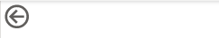

---
lab:
  title: Merancang Laporan di Power BI Desktop, Bagian 2
  module: Module 7 - Create Reports
ms.openlocfilehash: 72d571e81320d4c0311f9e566d1805725439f961
ms.sourcegitcommit: 9ea1e7e21b9b3c718030c94b1693d153a2010ec7
ms.translationtype: HT
ms.contentlocale: id-ID
ms.lasthandoff: 06/29/2022
ms.locfileid: "146650207"
---
# **Merancang Laporan di Power BI Desktop, Bagian 2**

**Perkiraan waktu untuk menyelesaikan lab adalah 45 menit**

Di lab ini, Anda akan menyempurnakan **Analisis Penjualan** dengan fitur desain tingkat lanjut.

Di lab ini Anda mempelajari cara:

- Menyinkronkan pemotong

- Membuat halaman drillthrough

- Menerapkan pemformatan bersyarat

- Membuat dan menggunakan bookmark

### **Cerita lab**

Lab ini adalah salah satu dari sekian banyak lab yang dirancang sebagai cerita lengkap, mulai dari persiapan data hingga publikasi sebagai laporan dan dasbor. Anda dapat menyelesaikan lab dalam urutan apa pun. Namun, jika Anda ingin mengerjakan beberapa lab sekaligus, sebaiknya Anda mengerjakannya dengan urutan berikut:

1. Mempersiapkan Data di Power BI Desktop

2. Muat Data di Power BI Desktop

3. Data Model di Power BI Desktop

5. Membuat Perhitungan DAX di Power BI Desktop, Bagian 1

6. Membuat Perhitungan DAX di Power BI Desktop, Bagian 2

7. Merancang Laporan di Power BI Desktop, Bagian 1

8. **Merancang Laporan di Power BI Desktop, Bagian 2**

9. Buat Dasbor Power BI

10. Menganalisis Data di Power BI Desktop

11. Terapkan Keamanan Tingkat Baris

## **Latihan 1: Mengonfigurasi Sinkronisasi Pemotong**

Dalam latihan ini Anda akan menyinkronkan pemotong halaman laporan.

### Tugas 1: Memulai – Masuk

Dalam tugas ini, Anda akan menyiapkan lingkungan untuk lab dengan masuk ke Power BI.

*Penting: Jika Anda sudah masuk ke Power BI, lanjutkan dari tugas berikutnya.*

1. Untuk membuka Microsoft Edge, pada bilah tugas, klik pintasan program Microsoft Edge.

    

1. Di jendela browser Microsoft Edge, navigasikan ke **https://powerbi.microsoft.com** .

    *Tips: Anda juga dapat menggunakan favorit Layanan Power BI di bilah favorit Microsoft Edge.*

1. Klik **Masuk** (terletak di sudut kanan atas).

    

1. Masukkan detail akun yang diberikan kepada Anda.

1. Jika diminta untuk memperbarui kata sandi, masukkan kembali kata sandi yang diberikan, lalu masukkan dan konfirmasikan kata sandi baru.

    *Penting: Pastikan untuk mencatat kata sandi baru Anda.*

1. Selesaikan proses masuk.

1. Jika diminta oleh Microsoft Edge untuk tetap masuk, klik **Ya**.

1. Di jendela browser Microsoft Edge, di layanan Power BI, di panel **Navigasi**, luaskan **Ruang Kerja Saya**.

    

1. Biarkan jendela browser Microsoft Edge terbuka.

### Tugas 2: Memulai – Membuka laporan

Dalam tugas ini, Anda akan menyiapkan lingkungan untuk lab dengan membuka laporan awal.

*Penting: Jika Anda melanjutkan dari lab sebelumnya (dan Anda berhasil menyelesaikan lab tersebut), jangan selesaikan tugas ini; sebagai gantinya, lanjutkan dari tugas berikutnya.*

1. Untuk membuka Power BI Desktop, pada taskbar, klik pintasan Microsoft Power BI Desktop.

    

2. Untuk menutup jendela memulai, di kiri atas jendela, klik **X**.

    

3. Untuk masuk ke layanan Power BI, di kanan atas, klik **Masuk**.

    

4. Selesaikan proses masuk menggunakan akun yang sama yang digunakan untuk masuk ke layanan Power BI.

5. Untuk membuka file Power BI Desktop pertama, klik tab pita **File** untuk membuka tampilan backstage.

6. Pilih **Buka Laporan**.

    

7. Klik **Jelajahi Laporan**.

    

8. Di jendela **Buka**, navigasikan ke folder **D:\PL300\Labs\07-design-report-in-power-bi-desktop-enhanced\Starter**.

9. Pilih file **Analisis Penjualan**.

10. Klik **Buka**.

    

11. Tutup semua jendela informasi yang mungkin terbuka.

12. Untuk membuat salinan file, klik tab pita **File** untuk membuka tampilan backstage.

13. Pilih **Simpan**.

    

14. Jika diminta untuk menerapkan perubahan, klik **Terapkan**.

    

15. Di jendela **Simpan Sebagai**, navigasikan ke folder **D:\PL300\MySolution**.

16. Klik **Simpan**.

    

### **Tugas 3: Menyinkronkan pemotong**

Dalam tugas ini, Anda akan menyinkronkan pemotong **Tahun** dan **Wilayah**.

*Anda akan melanjutkan pengembangan laporan yang dibuat di lab **Merancang Laporan di Power BI Desktop, Bagian 1**.*

1. Di Power BI Desktop, pada halaman **Ringkasan**, atur pemotong **Tahun** ke **FY2018**.

2. Buka halaman **Performa Saya**, lalu perhatikan bahwa pemotong **Tahun** adalah nilai yang berbeda.

    *Jika pemotong tidak disinkronkan, pemotong dapat menyebabkan kesalahan penyajian data dan frustrasi bagi pengguna laporan. Sekarang Anda akan menyinkronkan pemotong laporan.*

3. Kembali ke halaman **Ringkasan**, lalu pilih pemotong **Tahun**.

4. Pada tab pita **Lihat**, dari dalam grup **Tampilkan Panel**, klik **Sinkronkan Pemotong**.

    

5. Di panel **Sinkronkan Pemotong** (di sebelah kiri panel **Visualisasi**), di kolom kedua (yang menunjukkan sinkronisasi), centang kotak untuk **Ringkasan** dan Halaman **Performa Saya**.

    

6. Pada halaman **Ringkasan**, pilih pemotong **Wilayah**.

7. Sinkronkan pemotong dengan halaman **Ringkasan** dan **Keuntungan**.

    

8. Uji sinkronisasi pemotong dengan memilih opsi filter yang berbeda, lalu verifikasi bahwa pemotong yang disinkronkan memfilter berdasarkan pilihan yang sama.

9. Untuk menutup halaman **Sinkronisasi Pemotong**, klik **X** yang terletak di kanan atas panel.

    

## **Latihan 2: Mengonfigurasi Penelusuran**

Dalam latihan ini Anda akan membuat halaman baru dan mengonfigurasinya sebagai halaman penelusuran. Setelah Anda menyelesaikan desain, halaman akan terlihat seperti berikut:

### **Tugas 1: Membuat halaman penelusuran**

Dalam tugas ini, Anda akan membuat halaman baru dan mengonfigurasinya sebagai halaman penelusuran.

1. Tambahkan halaman laporan baru bernama **Detail Produk**.

    

2. Klik kanan tab halaman **Detail Produk**, lalu pilih **Sembunyikan Halaman**.

    

    *Pengguna laporan tidak akan dapat membuka halaman penelusuran secara langsung. Pengguna harus mengaksesnya dari visual di halaman lain. Anda akan mempelajari cara menelusuri halaman dalam latihan terakhir lab ini.*

3. Di bawah panel **Visualisasi**, di bagian **Penelusuran**, tambahkan bidang **Produk \| Kategori** ke kotak **Tambahkan Bidang Penelusuran Di Sini**.

    *Lab menggunakan notasi steno untuk mereferensikan bidang. Ini akan terlihat seperti ini: **Produk \| Kategori**. Dalam contoh ini, **Produk** adalah nama tabel dan **Kategori** adalah nama bidang.*

    

4. Untuk menguji halaman penelusuran, di kartu filter penelusuran, pilih **Sepeda**.

    

5. Di kiri atas halaman laporan, perhatikan tombol panah.

    

    *Tombol ditambahkan secara otomatis ketika bidang ditambahkan ke penelusuran sumber/area. Hal ini memungkinkan pengguna laporan untuk menavigasi kembali ke halaman tempat mereka melakukan penelusuran.*

6. Tambahkan visual **Kartu** ke halaman, lalu ubah ukuran dan posisinya sehingga berada di sebelah kanan tombol dan memenuhi sisa lebar halaman yang tersisa.

    

    

7. Seret bidang **Produk \| Kategori** ke dalam visual kartu.

8. Konfigurasikan opsi format untuk visual, lalu ubah properti **Label Kategori** ke **Nonaktif**.

    

9. Atur properti **Warna Latar Belakang** ke warna abu-abu terang.

10. Tambahkan visual **Tabel** ke halaman, lalu ubah ukuran dan posisinya sehingga berada di bawah visual kartu dan memenuhi ruang yang tersisa di halaman.

    

    

11. Tambahkan bidang berikut ke visual:

    - Produk \| Subkategori

    - Produk \| Warna

    - Penjualan \| Kuantitas

    - Penjualan \| Penjualan

    - Penjualan \| Margin Keuntungan

12. Konfigurasikan opsi format untuk visual, dan di bagian **Nilai**, atur properti **Ukuran Teks** ke **20pt**.

    *Desain halaman penelusuran hampir selesai. Anda akan menyempurnakan halaman dengan pemformatan bersyarat di latihan berikutnya.*

## **Latihan 3: Menambahkan Pemformatan Bersyarat**

Dalam latihan ini Anda akan menyempurnakan halaman penelusuran dengan pemformatan bersyarat. Setelah Anda menyelesaikan desain, halaman akan terlihat seperti berikut:

### **Tugas 1: Menambahkan pemformatan bersyarat**

Dalam tugas ini, Anda akan menyempurnakan halaman penelusuran dengan pemformatan bersyarat.

1. Pilih visual tabel.

2. Di panel visualisasi, klik panah bawah pada nilai **Margin Keuntungan**, lalu pilih Ikon **Pemformatan Bersyarat \|** .

    

3. Di jendela **Ikon – Margin Keuntungan**, dalam daftar dropdown **Tata Letak Ikon**, pilih **Sebelah Kanan Data**.

    

4. Untuk menghapus aturan tengah, di sebelah kiri segitiga kuning, klik **X**.

    

5. Konfigurasikan aturan pertama (berlian merah) sebagai berikut:

    - Di kontrol kedua, hapus nilainya

    - Di kontrol ketiga, pilih **Nomor**

    - Di kontrol kelima, masukkan **0**

    - Di kontrol keenam, pilih **Nomor**

6. Konfigurasikan aturan kedua (lingkaran hijau) sebagai berikut:

    - Di kontrol kedua, masukkan **0**

    - Di kontrol ketiga, pilih **Nomor**

    - Di kontrol kelima, hapus nilainya

    - Di kontrol keenam, pilih **Nomor**

    

    *Aturannya dapat diartikan sebagai berikut: tampilkan berlian merah jika nilai margin keuntungan kurang dari 0; sebaliknya jika nilainya besar atau sama dengan nol, tampilkan lingkaran hijau.*

7. Klik **OK**.

    

8. Dalam visual tabel, pastikan bahwa ikon yang benar ditampilkan.

    

9. Konfigurasikan pemformatan bersyarat warna latar belakang untuk bidang **Warna**.

10. Di jendela **Warna Latar Belakang – Warna**, di daftar dropdown **Gaya Format**, pilih **Nilai Bidang**.

    

11. Di daftar dropdown **Di bidang apa kita harus mendasarkan ini?** , pilih **Produk \| Pemformatan \| Format Warna Latar Belakang**.

    

12. Klik **OK**.

    

13. Ulangi langkah sebelumnya untuk mengonfigurasi pemformatan bersyarat warna font untuk bidang **Warna**, menggunakan bidang **Produk \| Pemformatan \| Format Warna Font**

    *Anda mungkin ingat bahwa latar belakang dan warna font berasal dari file **ColorFormats.csv** di lab **Mempersiapkan Data di Power BI Desktop**, lalu terintegrasi dengan kueri **Produk** di lab **Memuat Data di Power BI Desktop**.*

## **Latihan 4: Menambahkan Bookmark dan Tombol**

Dalam latihan ini, Anda akan menyempurnakan halaman **Performa Saya** dengan tombol, yang memungkinkan pengguna laporan memilih jenis visual yang akan ditampilkan. Setelah Anda menyelesaikan desain, halaman akan terlihat seperti berikut:

### **Tugas 1: Menambahkan bookmark**

Dalam tugas ini Anda akan menambahkan dua bookmark, satu untuk menampilkan setiap visual penjualan/target bulanan.

1. Buka halaman **Performa Saya**.

2. Pada tab pita **Lihat**, dari dalam grup **Tampilkan Panel**, klik **Bookmark**.

    

3. Pada tab pita **Lihat**, dari dalam grup **Tampilkan Panel**, klik **Pilihan**.

    

4. Di panel **Pilihan**, di samping salah satu item **Penjualan dan Target berdasarkan Bulan**, untuk menyembunyikan visual, klik ikon mata.

    

5. Di panel **Bookmark**, klik **Tambahkan**.

    

6. Untuk mengganti nama bookmark, klik dua kali bookmark.

7. Jika bagan yang terlihat adalah bagan batang, ganti nama bookmark menjadi **Bagan Batang AKTIF**, jika tidak, ganti nama bookmark menjadi **Bagan Kolom AKTIF**.

8. Untuk mengedit bookmark, di panel **Bookmark**, arahkan kursor ke bookmark, klik elipsis, lalu pilih **Data**.

    

    *Menonaktifkan opsi **Data** berarti bookmark tidak akan menggunakan status filter saat ini. Hal tersebut penting karena jika tidak, bookmark akan mengunci secara permanen filter yang saat ini diterapkan oleh pemotong **Tahun**.*

9. Untuk memperbarui bookmark, klik lagi elipsis, lalu pilih **Perbarui**.

    

    *Di langkah berikutnya, Anda akan membuat dan mengonfigurasi bookmark kedua untuk menampilkan visual kedua.*

10. Di panel **Pilihan**, alihkan visibilitas dua item **Penjualan dan Target berdasarkan Bulan**.

    *Dengan kata lain, buat visual yang terlihat menjadi tersembunyi, dan buat visual yang tersembunyi menjadi terlihat.*

    

11. Buat bookmark kedua, dan beri nama yang sesuai (baik **Bagan Kolom AKTIF** atau **Bagan Batang AKTIF).**

    

12. Konfigurasikan bookmark kedua untuk mengabaikan filter (opsi **Data** nonaktif), dan perbarui bookmark.

13. Di panel **Pilihan**, untuk membuat kedua visual terlihat, cukup tampilkan visual yang tersembunyi.

14. Ubah kembali ukuran dan posisi dari kedua visual sehingga memenuhi halaman di bawah visual multi-kartu, dan benar-benar tumpang tindih satu sama lain.

    *Tips: Untuk memilih visual yang dicakup, pilih di panel **Pilihan**.*

    

15. Di panel **Bookmark**, pilih setiap bookmark, dan perhatikan bahwa hanya satu visual yang terlihat.

    *Tahap desain berikutnya adalah menambahkan dua tombol ke halaman, yang memungkinkan pengguna laporan memilih bookmark.*

### **Tugas 2: Menambahkan tombol**

Dalam tugas ini Anda akan menambahkan dua tombol, dan menetapkan tindakan bookmark untuk masing-masing tombol.

1. Pada pita **Sisipkan**, dari dalam grup **Elemen**, klik **Tombol**, lalu pilih **Kosong**.

    

2. Menempatkan tombol tepat di bawah pemotong **Tahun**.

3. Pilih tombol, lalu di panel **tombol Format**, klik **Umum** dan ubah properti **Judul** menjadi **Aktif**.

    

4. Luaskan bagian **Judul**, lalu di kotak **Teks**, masukkan **Bagan Batang**.

5. Luaskan bagian **Latar Belakang**, lalu atur warna latar belakang menggunakan warna pelengkap.

6. Klik **Tombol** dan ubah properti **Tindakan** menjadi **Aktif**.

    

7. Luaskan bagian **Tindakan**, lalu atur daftar dropdown **Jenis** ke **Bookmark**.

8. Dalam daftar dropdown **Bookmark**, pilih **Diagram Batang AKTIF**.

    

9. Buat salinan tombol dengan menggunakan salin dan tempel, lalu konfigurasikan tombol baru sebagai berikut:

    *Tips: Perintah pintasan untuk salin dan tempel adalah **Ctrl+C** diikuti oleh **Ctrl+V**.*

    - Atur properti **Teks Tombol** ke **Bagan Kolom**

    - Di bagian **Tindakan**, atur daftar dropdown **Bookmark** ke **Bagan Kolom AKTIF**

    *Desain laporan Analisis Penjualan kini telah selesai.*

### **Tugas 3: Menerbitkan laporan**

Dalam tugas ini Anda akan menerbitkan laporan.

1. Pilih halaman **Gambaran Umum**.

2. Di pemotong **Tahun**, pilih **FY2020**.

3. Di pemotong **Wilayah**, **Pilih Semua**.

4. Simpan file Power BI Desktop.

    *File harus selalu disimpan sebelum diterbitkan ke layanan Power BI.*

5. Pada tab pita **Beranda**, dari dalam grup **Bagikan**, klik **Terbitkan**.

    

6. Di jendela **Terbitkan ke Power** BI, perhatikan bahwa **Ruang Kerja Saya** dipilih.

7. Untuk menerbitkan laporan, klik **Pilih**.

    

8. Jika diminta untuk mengganti himpunan data, klik **Ganti**.

9. Ketika publikasi telah berhasil, klik **Mengerti**.

    

10. Dapatkan Power BI Desktop.

    *Anda akan mempelajari laporan di layanan Power BI pada latihan berikutnya.*

## **Latihan 5: Menjelajahi Laporan**

Dalam latihan ini Anda akan menjelajahi laporan di layanan Power BI.

### **Tugas 1: Menjelajahi laporan**

Dalam tugas ini Anda akan menjelajahi laporan di layanan Power BI.

1. Di jendela browser Microsoft Edge, di layanan Power BI, di panel **Navigasi**, pilih **Ruang Kerja Saya**, lalu klik laporan **Analisis Penjualan**.

2. Untuk menguji laporan penelusuran, di halaman **Ringkasan**, dalam visual **Jumlah berdasarkan Kategori**, klik kanan bilah **Pakaian**, lalu pilih **Telusuri \| Detail Produk**.

    

3. Perhatikan bahwa halaman **Detail Produk** adalah untuk **Pakaian**.

4. Untuk kembali ke halaman sumber, di pojok kiri atas halaman, klik tombol panah.

5. Pilih halaman **Performa Saya**.

6. Klik setiap tombol, dan kemudian perhatikan bahwa visual yang berbeda ditampilkan.

### **Tugas 2: Selesaikan**

Dalam tugas ini Anda akan menyelesaikan lab.

1. Untuk kembali ke ruang kerja Anda, pada spanduk di halaman web jendela, klik **Ruang Kerja Saya**.

    

2. Biarkan jendela browser Microsoft Edge terbuka.
